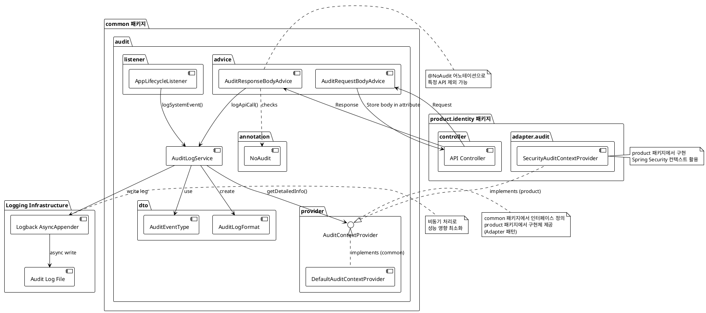
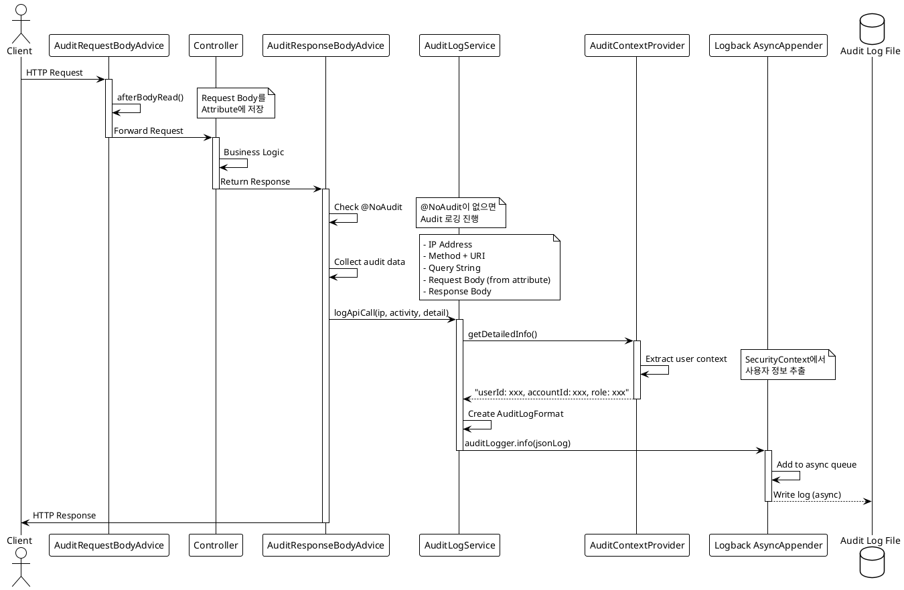
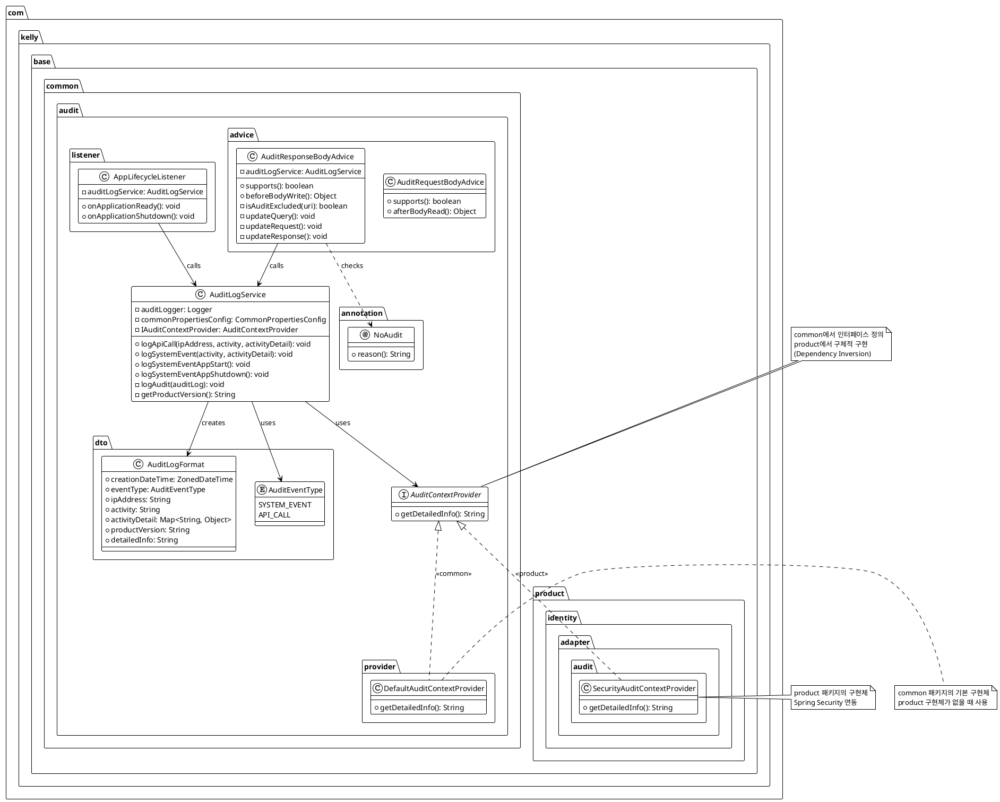

# Audit 시스템 가이드

## 개요

### 목적

Audit 시스템은 애플리케이션의 모든 중요한 이벤트를 추적하고 기록하여 보안, 컴플라이언스, 디버깅 목적으로 활용할 수 있도록 합니다.

### 주요 기능

- **자동 API 호출 로깅**: 모든 API 요청/응답을 자동으로 기록
- **시스템 이벤트 로깅**: 애플리케이션 시작/종료 등 시스템 이벤트 기록
- **비동기 로깅**: 메인 로직에 영향을 주지 않는 비동기 처리
- **사용자 컨텍스트 추적**: 인증된 사용자 정보 자동 기록
- **선택적 로깅 제외**: `@NoAudit` 어노테이션을 통한 로깅 제외

---

## 아키텍처

### 전체 구조



### API 호출 시 Audit 로깅 흐름



### 클래스 다이어그램



---

## 핵심 컴포넌트

### 1. AuditLogService

**위치**: `com.kelly.base.common.audit.AuditLogService`

Audit 로깅의 핵심 서비스로, 모든 audit log 저장 요청을 처리합니다.

**주요 메서드**:

- `logApiCall(String ipAddress, String activity, Map<String, Object> activityDetail)`
    - API 호출에 대한 audit log 저장
    - IP 주소, 호출된 API 정보, request/response payload 기록

- `logSystemEvent(String activity, Map<String, Object> activityDetail)`
    - 시스템 이벤트에 대한 audit log 저장

- `logSystemEventAppStart()` / `logSystemEventAppShutdown()`
    - 애플리케이션 시작/종료 이벤트 로깅

**특징**:

- 비동기 로깅으로 성능 영향 최소화
- 로깅 실패 시 error log 기록
- AuditContextProvider를 통한 사용자 컨텍스트 정보 자동 추가

### 2. AuditLogFormat

**위치**: `com.kelly.base.common.audit.dto.AuditLogFormat`

Audit log의 데이터 구조를 정의하는 record 클래스입니다.

**필드**:

- `creationDateTime`: 로그 생성 시간 (ZonedDateTime)
- `eventType`: 이벤트 타입 (AuditEventType)
- `ipAddress`: 클라이언트 IP 주소
- `activity`: 수행된 작업 (예: "GET /api/accounts")
- `activityDetail`: 작업 상세 정보 (request/response payload 등)
- `productVersion`: 애플리케이션 버전
- `detailedInfo`: 추가 상세 정보 (사용자 정보 등)

**특징**:

- JSON 직렬화 시 필드명이 UpperCamelCase로 변환
- ISO-8601 형식의 시간 포맷 사용

### 3. AuditEventType

**위치**: `com.kelly.base.common.audit.dto.AuditEventType`

Audit 이벤트의 타입을 정의하는 enum입니다.

```java
public enum AuditEventType {
    SYSTEM_EVENT(0, "system event"),    // 시스템 이벤트
    API_CALL(1000, "call API");         // API 호출
}
```

### 4. AuditRequestBodyAdvice

**위치**: `com.kelly.base.common.audit.advice.AuditRequestBodyAdvice`

Request body를 읽어서 HttpServletRequest의 attribute에 저장하는 ControllerAdvice입니다.

**역할**:

- API 요청의 body를 읽어서 `ATTR_AUDIT_REQ_BODY` attribute에 저장
- AuditResponseBodyAdvice에서 request body에 접근할 수 있도록 지원

### 5. AuditResponseBodyAdvice

**위치**: `com.kelly.base.common.audit.advice.AuditResponseBodyAdvice`

Response가 클라이언트로 전송되기 전에 audit log를 기록하는 ControllerAdvice입니다.

**역할**:

- `@NoAudit` 어노테이션 확인 및 제외 처리
- URI 패턴 기반 제외 처리 (Swagger, Actuator 등)
- Query String, Request Body, Response Body 수집
- AuditLogService를 통한 로그 저장

**수집 정보**:

- `query`: Query String
- `requestPayload`: Request Body
- `responsePayload`: Response Body

### 6. AuditContextProvider

**위치**: `com.kelly.base.common.interfaces.IAuditContextProvider`

Audit log에 추가할 컨텍스트 정보를 제공하는 인터페이스입니다.

**구현체**:

#### DefaultAuditContextProvider

기본 구현체로, 추가 정보를 제공하지 않습니다 (null 반환).

#### SecurityAuditContextProvider

**위치**: `com.kelly.base.product.identity.adapter.audit.SecurityAuditContextProvider`

Spring Security의 SecurityContext에서 현재 로그인한 사용자 정보를 추출하여 제공합니다.

**제공 정보**:

```
userId: [로그인ID], accountId: [계정ID], role: [역할코드]
```

### 7. AppLifecycleListener

**위치**: `com.kelly.base.common.audit.listener.AppLifecycleListener`

애플리케이션의 시작과 종료 이벤트를 감지하여 audit log를 기록합니다.

**이벤트 리스너**:

- `@EventListener(ApplicationReadyEvent.class)`: 애플리케이션 시작 완료 시
- `@EventListener(ContextClosedEvent.class)`: 애플리케이션 종료 시

### 8. @NoAudit 어노테이션

**위치**: `com.kelly.base.common.audit.annotation.NoAudit`

특정 Controller 메서드 또는 클래스를 audit 로깅에서 제외하는 어노테이션입니다.

**사용 위치**:

- Method 레벨
- Class 레벨

**속성**:

- `reason`: audit 제외 사유 (기본값: "audit is not required")

---

## 설정 및 구성

### Logback 설정

**위치**: `src/main/resources/logback-spring.xml`

#### Audit Log 파일 설정

```xml

<property name="AUDIT_LOG_FILE" value="${AUDIT_LOG_FILE:-logs/${APPLICATION_NAME}-audit.log}"/>
<property name="AUDIT_LOG_FILE_MAX_SIZE" value="${AUDIT_LOG_FILE_MAX_SIZE:-100MB}"/>
<property name="AUDIT_LOG_FILE_MAX_HISTORY" value="${AUDIT_LOG_FILE_MAX_HISTORY:-730}"/>
<property name="AUDIT_LOG_FILE_TOTAL_SIZE_CAP" value="${AUDIT_LOG_FILE_TOTAL_SIZE_CAP:-1GB}"/>
```

**특징**:

- 파일 크기: 최대 100MB
- 보관 기간: 730일 (2년)
- 총 용량: 최대 1GB
- 로그 파일명: `base-backend-audit.log`

#### 비동기 Appender 설정

```xml

<appender name="ASYNC_AUDIT" class="ch.qos.logback.classic.AsyncAppender">
    <appender-ref ref="AUDIT_FILE"/>
    <queueSize>8192</queueSize>
    <discardingThreshold>0</discardingThreshold>
    <neverBlock>true</neverBlock>
</appender>
```

**설정 의미**:

- `queueSize: 8192`: 비동기 큐 크기
- `discardingThreshold: 0`: 큐 사용량과 관계없이 모든 로그 유지
- `neverBlock: true`: 로그 생성이 메인 로직 성능에 영향을 주지 않도록 설정 (로그 손실 가능성이 있으나 성능 우선으로 설정)

#### Logger 설정

```xml

<logger name="AUDIT_LOGGER" level="INFO" additivity="false">
    <appender-ref ref="ASYNC_AUDIT"/>
</logger>
```

### 상수 정의

**위치**: `com.kelly.base.common.CommonConstants.AuditConstants`

```java
public static final class AuditConstants {
    // 시간 패턴
    public static final String LOG_PATTERN = "yyyy-MM-dd'T'HH:mm:ss.SSSX";

    // Request body 저장용 attribute 키
    public static final String ATTR_AUDIT_REQ_BODY = "ATTR_AUDIT_REQ_BODY";

    // 기본 제외 URI 패턴
    public static final List<String> EXCLUDED_URI_PATTERNS = List.of(
            "/swagger-ui/**",
            "/v3/api-docs/**",
            "/actuator/**"
    );
}
```

---

## 사용 방법

### 1. 자동 로깅 (기본 동작)

모든 Controller의 API 호출은 자동으로 audit log에 기록됩니다. 별도의 코드 작성이 필요하지 않습니다.

```java

@RestController
@RequestMapping("/api/accounts")
public class AccountsController {

    @GetMapping("/{accountId}")
    public CommonResponse<AccountDto> retrieve(@PathVariable Long accountId) {
        // 이 메서드는 자동으로 audit log에 기록됩니다
        return CommonResponse.success(accountService.retrieve(accountId));
    }
}
```

### 2. 로깅 제외

특정 API를 audit 로깅에서 제외하려면 `@NoAudit` 어노테이션을 사용합니다.

#### 메서드 레벨

```java

@RestController
@RequestMapping("/api/health")
public class HealthController {

    @GetMapping
    @NoAudit(reason = "health check endpoint")
    public String health() {
        return "OK";
    }
}
```

#### 클래스 레벨

```java

@RestController
@RequestMapping("/api/internal")
@NoAudit(reason = "internal API")
public class InternalController {
    // 이 Controller의 모든 메서드가 audit 로깅에서 제외됩니다
}
```

### 3. 커스텀 시스템 이벤트 로깅

애플리케이션 내에서 중요한 시스템 이벤트를 수동으로 기록할 수 있습니다.

```java

@Service
@RequiredArgsConstructor
public class SomeService {
    private final AuditLogService auditLogService;

    public void executeScheduler() {
        Map<String, Object> detail = Map.of(
                "schedulerName", "DataSyncScheduler",
                "status", "started"
        );

        auditLogService.logSystemEvent("Scheduler Execution", detail);

        // 스케줄러 로직...
    }
}
```

### 4. URI 패턴 기반 제외

`CommonConstants.AuditConstants.EXCLUDED_URI_PATTERNS`에 정의된 패턴은 자동으로 제외됩니다:

- `/swagger-ui/**`
- `/v3/api-docs/**`
- `/actuator/**`

추가 패턴이 필요한 경우 이 리스트를 수정하면 됩니다.

---

## 로그 형식 및 예시

### JSON 로그 구조

Audit log는 JSON 형식으로 저장되며, 다음과 같은 구조를 가집니다:

```json
{
    "CreationDateTime": "2025-11-25T00:18:01.873Z",
    "EventType": {
        "code": 1000,
        "description": "call API"
    },
    "IpAddress": "192.168.1.100",
    "Activity": "POST /api/auth/login",
    "ActivityDetail": {
        "query": null,
        "requestPayload": {
            "loginId": "user01",
            "password": "*****"
        },
        "responsePayload": {
            "code": "S0000",
            "message": "Success",
            "data": {
                "accountId": 12345,
                "loginId": "user01"
            }
        }
    },
    "ProductVersion": "base-backend v1.0.0",
    "DetailedInfo": "userId: user01, accountId: 12345, role: USER"
}
```

### API 호출 로그 예시

#### 성공적인 로그인 요청

```json
{
    "CreationDateTime": "2025-11-25T00:18:01.873Z",
    "EventType": {
        "code": 1000,
        "description": "call API"
    },
    "IpAddress": "192.168.1.100",
    "Activity": "POST /api/auth/login",
    "ActivityDetail": {
        "requestPayload": {
            "loginId": "user01",
            "password": "*****"
        },
        "responsePayload": {
            "code": "S0000",
            "message": "Success"
        }
    },
    "ProductVersion": "base-backend v1.0.0",
    "DetailedInfo": "userId: user01, accountId: 12345, role: USER"
}
```

#### GET 요청 (Query String 포함)

```json
{
    "CreationDateTime": "2025-11-25T00:18:01.873Z",
    "EventType": {
        "code": 1000,
        "description": "call API"
    },
    "IpAddress": "192.168.1.101",
    "Activity": "GET /api/accounts/search",
    "ActivityDetail": {
        "query": "keyword=john&page=1&size=10",
        "responsePayload": {
            "code": "S0000",
            "message": "Success",
            "data": [
                ...
            ]
        }
    },
    "ProductVersion": "base-backend v1.0.0",
    "DetailedInfo": "userId: admin, accountId: 1, role: ADMIN"
}
```

### 시스템 이벤트 로그 예시

#### 애플리케이션 시작

```json
{
    "CreationDateTime": "2025-11-25T00:18:01.873Z",
    "EventType": {
        "code": 0,
        "description": "system event"
    },
    "IpAddress": "N/A",
    "Activity": "Server Start",
    "ActivityDetail": {
        "message": "application started successfully"
    },
    "ProductVersion": "base-backend v1.0.0",
    "DetailedInfo": null
}
```

#### 애플리케이션 종료

```json
{
    "CreationDateTime": "2025-11-25T00:18:01.873Z",
    "EventType": {
        "code": 0,
        "description": "system event"
    },
    "IpAddress": "N/A",
    "Activity": "Server Shutdown",
    "ActivityDetail": {
        "message": "application shutdown initiated"
    },
    "ProductVersion": "base-backend v1.0.0",
    "DetailedInfo": null
}
```

#### 커스텀 시스템 이벤트

```json
{
    "CreationDateTime": "2025-11-25T00:18:01.873Z",
    "EventType": {
        "code": 0,
        "description": "system event"
    },
    "IpAddress": "N/A",
    "Activity": "Scheduler Execution",
    "ActivityDetail": {
        "schedulerName": "DataSyncScheduler",
        "status": "started"
    },
    "ProductVersion": "base-backend v1.0.0",
    "DetailedInfo": null
}
```

---

## 확장 가능성

### 1. 커스텀 AuditContextProvider 구현

프로젝트의 특성에 맞게 audit log에 추가 정보를 포함할 수 있습니다.

```java

@Component
public class CustomAuditContextProvider implements AuditContextProvider {

    @Override
    public String getDetailedInfo() {
        // 커스텀 컨텍스트 정보 제공
        // 예: 현재 테넌트 정보, 세션 정보 등
        return "tenantId: xxx, sessionId: yyy";
    }
}
```

### 2. 추가 이벤트 타입 정의

필요에 따라 `AuditEventType` enum에 새로운 이벤트 타입을 추가할 수 있습니다.

```java
public enum AuditEventType {
    SYSTEM_EVENT(0, "system event"),
    API_CALL(1000, "call API"),
    SECURITY_EVENT(2000, "security event"),  // 추가
    DATA_CHANGE(3000, "data change");        // 추가
}
```

### 3. 민감 정보 마스킹

`AuditResponseBodyAdvice`를 확장하여 민감 정보를 자동으로 마스킹할 수 있습니다.

```java
private Object maskSensitiveData(Object data) {
    // password, ssn 등 민감 정보 마스킹 로직
    return maskedData;
}
```

---

## 참고 사항

### 성능 고려사항

- 비동기 로깅으로 메인 로직에 미치는 영향 최소화
- `neverBlock: true` 설정으로 극단적인 부하 시 로그 손실 가능성 존재
- 큐 크기(8192)를 조정하여 로그 손실과 메모리 사용량 균형 조정 가능

### 보안 고려사항

- 민감 정보(비밀번호 등)는 자동으로 마스킹되지 않으므로 필요 시 구현 필요
- 보관 기간(730일)은 요구사항에 맞게 조정 필요

### 트러블슈팅

1. **로그가 기록되지 않는 경우**
    - `@NoAudit` 어노테이션 확인
    - EXCLUDED_URI_PATTERNS에 포함되는지 확인
    - logback 설정 확인

2. **로그 파일 크기 증가 문제**
    - MAX_SIZE, MAX_HISTORY 설정 조정
    - 불필요한 API에 `@NoAudit` 적용

3. **성능 저하 발생**
    - AsyncAppender 큐 크기 확인
    - 로그 파일 I/O 성능 확인

---

## 작성자

서강희

## 변경 이력

| 버전  | 날짜         | 변경 내역                                            |
|-----|------------|--------------------------------------------------|
| 1.0 | 2025-11-05 | 초안 작성                                            |
| 1.1 | 2025-12-17 | `변경 이력` 업데이트<br>`IAuditContextProvider` 변경 사항 작성 |

